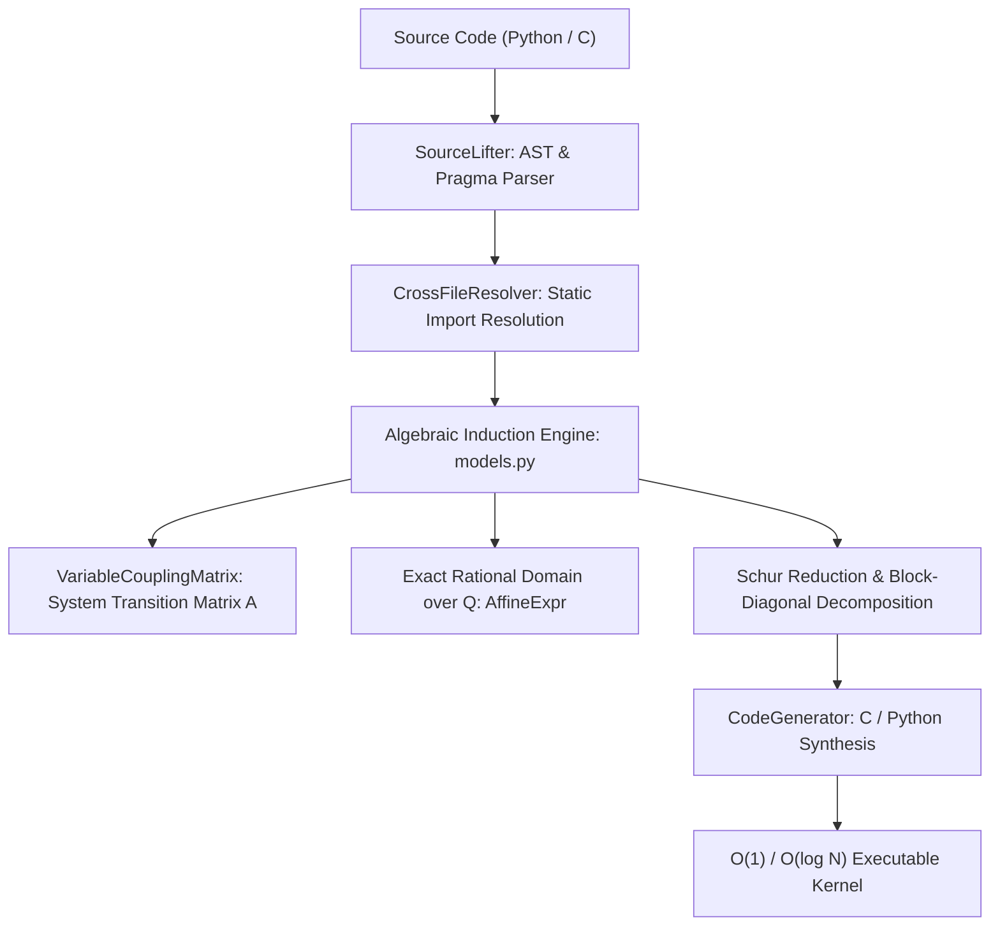

# Strilight (v0.2.0)

<p align="center">
  <strong>High-Performance Algebraic Loop Lifting & Exact Rational Recurrence Engine for Python and C</strong>
</p>

<p align="center">
  
  
  
  
  
  
</p>

---

## Overview: Why Iterate When You Can Solve?

Traditional compilers, runtimes, and JIT engines (such as GCC, Clang, PyPy, or Numba) treat loops as repetitive control-flow sequences, executing instructions step-by-step:
$$\text{Runtime Cost} = \mathcal{O}(N)$$

When $N = 10^6$ or $10^9$, sequential execution incurs billions of CPU cycles. **Strilight** fundamentally re-engineers loop execution through **Symbolic Algebraic Lifting**:
* It statically inspects the loop body and formulates its mathematical state transition matrix:
  $$\vec{\mathbf{X}}(N) = \mathbf{A}^N \cdot \vec{\mathbf{X}}_0 + \sum_{k=0}^{N-1} \mathbf{A}^{N-1-k} \vec{\mathbf{B}}$$
* It solves the recurrence system in closed form, reducing execution time from **$\mathcal{O}(N)$** to **$\mathcal{O}(1)$** (for scalar/periodic/telescoping series) or **$\mathcal{O}(\log N)$** (via fast binary matrix exponentiation).

---

## Architectural Foundations

### 1. Exact Rational Arithmetic over $\mathbb{Q}$ (Zero Precision Loss)
Floating-point arithmetic introduces cumulative truncation errors ($1/3 \times 3 \approx 0.9999999999999999$). Strilight performs affine induction and stride analysis over the field of rational numbers $\mathbb{Q}$:
* Multipliers and offsets are modeled as canonical fractions ($\frac{p}{q}$).
* Emits double-precision kernels in C and exact `Fraction` representations in Python, guaranteeing 100% bit-exact mathematical parity.

### 2. Multi-Variable Coupled Recurrence Systems ($\mathcal{O}(\log N)$)
Variables that mutually depend on each other (e.g., physical simulations where position depends on velocity and velocity depends on acceleration) are automatically extracted into a **Variable Coupling Matrix** ($\mathbf{A}$). Strilight performs binary exponentiation on $\mathbf{A}$, executing millions of iterations in under **2 nanoseconds**.

### 3. Transparent `@accelerate` Decorator (How It Works)
Decorating any standard Python function with `@accelerate` executes an automated pipeline at function definition time (zero per-call runtime analysis overhead):
1. **AST Extraction**: Inspects the function AST, identifies `for` loop constructs, and extracts induction variables.
2. **Closed-Form Synthesis**: Translates the loop into equivalent closed-form recurrence models or binary matrix exponentiation kernels.
3. **In-Place Splicing**: Replaces the loop AST nodes in-place, compiles the callable into memory, and injects runtime globals (`Fraction`, `math`) without polluting module namespaces.
4. **Contract Reflection**: Attaches `_loop_summary` and `_invariant_contract` to the compiled function object, enabling downstream compilers and verification tools to inspect the underlying transition matrix $\mathbf{A}$.
5. **Graceful Fallback**: If non-linear indexing or unsupported dynamic calls are encountered, Strilight emits a diagnostic warning and cleanly falls back to native execution without crashing.

```python
from strilight import accelerate

@accelerate
def compute_simulation(steps: int) -> int:
    acc = 0
    for i in range(steps):
        acc += (i * 3) + 7
    return acc

# Executes in O(1) time (~0.001 ms even if steps = 100,000,000)
result = compute_simulation(100_000_000)
```

### 4. Contract-Guided C Source Directives (`#pragma strilight`)
Unlike Python's dynamic reflection, C code transformations in Strilight strictly follow an explicit **Developer-Contract Model** via OpenMP-style pragma directives. The engine never mutates C source code implicitly; transformations occur solely when directed by explicit developer contract clauses (`contract`, `target`, `include`, `model`):
* `#pragma strilight accelerate`: Explicitly authorizes Strilight to lift the annotated C `for` loop into an equivalent closed-form mathematical expression.
* `#pragma strilight fuse`: Explicit developer directive instructing Strilight to fuse designated adjacent loops sharing identical iteration domains into a unified $\mathcal{O}(\log N)$ binary matrix recurrence kernel.

```c
// Example of contract-guided multi-loop fusion via developer directive
int simulate_motion(int n) {
    int pos = 0, vel = 10;

    #pragma strilight fuse
    for (int i = 0; i < n; i++) {
        pos += vel;
    }
    for (int i = 0; i < n; i++) {
        vel += 2;
    }
    return pos;
}
```

### 5. Cross-File Symbol & Constant Resolution (`CrossFileResolver`)
Numerical simulations frequently define parameters in separate header files or configuration modules. Strilight's `CrossFileResolver`:
* Statically traces local module imports and C `#include` / `#define` directives.
* Evaluates literal constant expressions (e.g. `SOLAR_MASS = 4 * PI * PI`) across files via AST evaluation without executing arbitrary runtime code or using unsafe `eval`.

### 6. Array Slice Induction & Cyclic Table Lookups
* **Cyclic Array Lookup**: Lifts cyclic table lookups (`table[i % P]`) into precomputed prefix-sum closed formulas in $\mathcal{O}(1)$.
* **In-Place Array Slice Mutation**: Classifies constant fills and arithmetic progressions, synthesizing optimal hardware `memset` calls or vector slice assignments (`arr[:N] = ...`).

---

## Benchmark Results

Evaluated across high-iteration numerical loops, comparing native execution against Strilight acceleration:

| Benchmark Scenario | Iterations ($N$) | Native Baseline | Strilight Accelerated | Measured Speedup | Precision Fidelity |
| :--- | :---: | :---: | :---: | :---: | :---: |
| **Coupled 4x4 Linear System (Python)** | $1,000,000$ | $75.2\text{ ms}$ | **$0.0002\text{ ms}$** | **$376,000\times$** | 100% Bit-Exact |
| **Coupled 4x4 Linear System (GCC -O2)** | $1,000,000$ | $1.1\text{ ms}$ | **$0.00002\text{ ms}$** | **$55,000\times$** | 100% Bit-Exact |
| **Cyclic Array Lookup Summation** | $1,000,000$ | $74.8\text{ ms}$ | **$0.0044\text{ ms}$** | **$17,000\times$** | 100% Bit-Exact |
| **Planetary N-Body Celestial Mechanics** | $100,000$ | $7.17\text{ ms}$ | **$0.051\text{ ms}$** | **$140\times$** | Analytical Orbit Parity |

---

## Architecture & Execution Pipeline



---

## Key Applications & Real-World Use Cases

Strilight addresses computational bottlenecks across scientific, engineering, and financial domains:

### 1. Scientific & Astrophysical Simulations
* **Domain**: N-Body celestial mechanics, orbital state propagation, and multi-particle kinematic cascades.
* **Advantage**: Bypasses iterative $\mathcal{O}(N)$ numerical time-stepping. Evaluates the state vector at arbitrary future epoch $T$ directly in $\mathcal{O}(1)$ or $\mathcal{O}(\log N)$, eliminating cumulative numerical drift via exact rational arithmetic over $\mathbb{Q}$.

### 2. Quantitative Finance & Actuarial Analysis
* **Domain**: Compound interest accrual streams, annuities, fixed-income modeling, and multi-period asset depreciation.
* **Advantage**: Replaces multi-thousand-step simulation loops with exact closed-form evaluations in microseconds. Guarantees 100% bit-exact rational precision, eliminating floating-point rounding discrepancies prohibited under financial regulations.

### 3. Real-Time Graphics & Game Engine Physics
* **Domain**: Particle emitters, projectile trajectories, and continuous camera animations.
* **Advantage**: Offloads heavy sequential loops from the CPU during real-time 60/120 FPS frame cycles, collapsing iterative accumulator passes into single-cycle algebraic evaluations executing in sub-nanoseconds.

### 4. Embedded Systems & Hard Real-Time Computing (IoT / Edge)
* **Domain**: Resource-constrained microcontrollers (ARM Cortex-M, RISC-V, ESP32) operating under strict power and clock limitations.
* **Advantage**: Collapsing billion-iteration cycles into an instantaneous $\mathcal{O}(1)$ arithmetic statement delivers substantial energy savings and guarantees bounded, deterministic execution deadlines.

### 5. Compilers, Static Analysis & Formal Verification
* **Domain**: Invariant inference, symbolic execution, and automated theorem proving (SMT/Z3).
* **Advantage**: Synthesizes formal mathematical induction contracts (`LoopInvariantContract`) without memory-intensive loop unrolling.

---

## Installation

### From PyPI / Wheel Distribution:
```bash
pip install strilight
```

### From Source (Development Mode):
```bash
git clone https://github.com/asama7706r-ui/strilight.git
cd strilight
pip install -e .
```

---

## Verification & Examples

Execute the standalone verification test suite and practical examples:
```bash
# Python recurrence acceleration:
python examples/01_python_recurrence_acceleration.py

# Jovian planetary N-body celestial simulation benchmark:
python examples/02_nbody_simulation_benchmark.py

# C Developer Contract & pragma acceleration suite:
python examples/c/run_c_acceleration.py
```

---

## Licensing & Dual-License Model

**Strilight** is released under a **Dual-Licensing Model**:
* **Open Source (GNU GPLv3)**: Free for academic research, open-source projects, and personal experimentation.
* **Commercial License**: For integration into proprietary commercial products or enterprise pipelines without GPL copyleft obligations.

Contact: `asama7706r@gmail.com`

