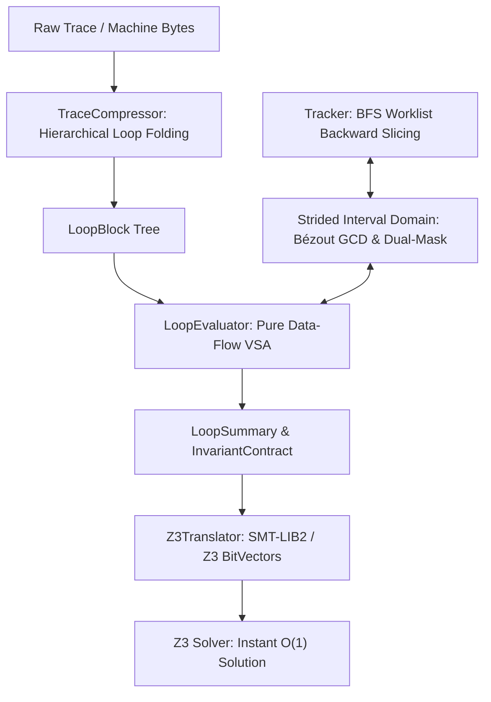

# 🌟 Strilight (v0.1.0-alpha)

<p align="center">
  <strong>High-Performance $O(1)$ SMT Loop Lifting & Strided Interval Domain for x86_64 Binary Analysis</strong>
</p>

<p align="center">
  
  
  
  
  
  
  
</p>

---

> [!WARNING]
> **🚨 Early Public Alpha Notice:**
> **Strilight** is currently in an **active Alpha development phase (`v0.1.0-alpha`)**. 
> While core mathematical formalisms, loop lifting algorithms, strided interval domains, and SMT translation are fully verified with extensive unit tests, certain high-level APIs, floating-point instructions, and edge cases are under active development.
> 
> * **Expect Breaking Changes:** API signatures and internal data structures may evolve between alpha releases.
> * **Feedback & Contributions:** We warmly welcome bug reports, edge cases, test binaries, and PRs from researchers and reverse engineers!

---

## 📖 1. Overview & The Core Problem

Traditional Symbolic Execution and Dynamic Binary Instrumentation (DBI) engines (such as *angr*, *Triton*, or *KLEE*) suffer from the notorious **Path & Loop Explosion Problem**. When encountering a loop executing $N = 100,000$ iterations, classical engines unroll the loop iteration-by-iteration:
* Generating hundreds of thousands of intermediate Single Static Assignment (SSA) variables.
* Exponentially expanding the search tree.
* Causing SMT solvers (Z3, CVC5) to time out or exhaust physical memory.

```
Traditional DBI / SMT (Linear Unrolling):
Trace:  [Iter 1] ──> [Iter 2] ──> ... ──> [Iter 100,000]  ===> O(N) Solver Explosion 💥

Strilight Engine (Zero-Unroll O(1) Lifting):
Trace ──> [TraceCompressor] ──> [LoopBlock] ──> [LoopEvaluator] ──> O(1) SMT Formula 🚀
```

**Strilight** eliminates loop unrolling by treating loops as **closed-form algebraic recurrences** within a formal **Strided Interval Domain**:

$$\vec{\mathbf{R}}(N) = \vec{\mathbf{R}}_0 + \vec{\boldsymbol{\Delta}} \cdot N$$

Instead of simulating $N$ iterations, **Strilight** compresses execution traces into hierarchical `LoopBlock` representations, extracts affine deltas and polycyclic periodic steps, and translates the entire loop directly into an **$O(1)$ Closed-Form SMT Constraint**.

---

## ⚡ 2. Key Architectural Innovations



1. **Zero-Unroll Trace Compression (`TraceCompressor`):** Identifies backward edges and sliding-window patterns to compress millions of linear instruction traces into compact hierarchical `LoopBlock` graphs in $<1\text{ ms}$.
2. **Strided Interval Domain in $\mathbb{Z} / 2^w \mathbb{Z}$ (`StridedInterval`):** Models value sets as $S = s[m, M]$ with hardware circular wrap-around, Bézout GCD transfer functions, and 3-valued dual-mask bitwise precision (`known_mask`, `known_value`).
3. **Instant Modulo Congruence Aliasing Pruning:** Proves 100% disjointness between memory accesses in $O(1)$ without solver queries:
   $$\gcd(s_1, s_2) = g > 1 \land (m_1 \bmod g \ne m_2 \bmod g) \implies S_1 \cap S_2 = \emptyset$$
4. **Polycyclic & Periodic Closed Forms:** Solves complex multi-step cyclic transformations ($P > 1$) using exact quotient-remainder closed formulas:
   $$\text{Delta}(N) = \lfloor \frac{N}{P} \rfloor \cdot \sum_{i=0}^{P-1} x_i + \text{PrefixSum}(N \bmod P)$$
5. **The $N-1$ Iron Invariant Contract:** Enforces strict boundary exit conditions via AST substitution to guarantee the solver does not produce spurious solutions by "teleporting" past loop exits:
   $$\text{Implies}\Big( N > 0, \; \text{PreExitCondition}(\text{State}(N-1)) == \text{False} \Big)$$
6. **Decoupled Modular Architecture:** Native Capstone disassembly with pluggable custom tracer bridges.

---

## 🧩 3. Engine Architecture & Alpha Status Matrix

| Component | Module Path | Status | Capabilities |
| :--- | :--- | :--- | :--- |
| **Trace Compressor** | `strilight.engine.loop_compressor` | **Stable (Alpha)** | Hierarchical loop folding, nested loop trees, pattern matching. |
| **Instruction Model** | `strilight.engine.instruction` | **Stable (Alpha)** | Decoupled Capstone bytecode disassembly & structured operand inspection. |
| **Tracker Bridge** | `strilight.engine.tracker_bridge` | **Stable (Alpha)** | Intra-block def-use slicing, jump classification, tracer pluggability. |
| **VSA Evaluator** | `strilight.engine.vsa_evaluator` | **Stable (Alpha)** | Pure data-flow engine, affine strides, polycyclic pattern extraction. |
| **Invariant Contract** | `strilight.engine.vsa_evaluator` | **Stable (Alpha)** | Formal $N-1$ exit boundary contracts & SMT rule generation. |
| **Central Tracker** | `strilight.engine.tracker` | **Beta (Alpha)** | Worklist-driven BFS backward/forward slicing, bitmask register tracking. |
| **Z3 Translator** | `strilight.engine.translator` | **Beta (Alpha)** | 50+ x86_64 instructions, subregister slicing/zero-extension, SSA BitVectors. |
| **Strided Interval** | `strilight.pruning.interval` | **Stable (Alpha)** | Circular domains, Bézout GCD arithmetic, dual-mask reduced product. |
| **Path Tree Cache** | `strilight.engine.path_tree` | **Beta (Alpha)** | Memoization cache for resolved slice branches & dead-end paths. |
| **Floating-Point Engine** | `strilight.engine.fpu` | *Planned (WIP)* | SSE/AVX floating point SMT theory lifting. |

---

## 📦 4. Installation & Distribution Profiles

**Strilight** is packaged modularly to suit different deployment profiles:

### Option 1: Standard Installation (Core Engine + Capstone)
```bash
pip install strilight
```

### Option 2: Solver Profile (Core + Z3 SMT Lifter)
```bash
pip install strilight[solver]
```

### Option 3: Full Bundle (All Components + Tracker + Solver)
```bash
pip install strilight[all]
```

### Development / Editable Installation
```bash
git clone https://github.com/asama7706r-ui/strilight.git
cd strilight
pip install -e .[all]
```

---

## 💡 5. Quickstart Guide

### Option A: One-Line Loop Analysis (`sl.analyze`)
Analyze raw x86-64 machine code bytes and extract their closed-form transformations in a single line:

```python
import strilight as sl

# Loop bytecode: add eax, 8; sub ebx, 3; inc ecx; cmp ecx, 100000; jl 0x1000
loop_bytes = bytes.fromhex("83c008 83eb03 ffc1 81f9a0860100 7ced")

# ONE-LINE ANALYSIS:
summary = sl.analyze(loop_bytes, iterations=100000)

print(f"Register Deltas: {summary.deltas}")
# Output: {'eax': 8, 'ebx': -3, 'ecx': 1}

print(f"Exit Condition: {summary.exit_condition}")
# Output: [jl 0x1000] (Depends on flags: ZF, SF, OF)
```

---

### Option B: Disassemble, Compress & Evaluate Step-by-Step

```python
import strilight as sl

# 1. Disassemble machine code bytes
instructions = sl.disassemble(loop_bytes, base_address=0x1000)

# 2. Package into a symbolic loop block
block = sl.LoopBlock(body=instructions, iterations=100000)

# 3. Extract closed-form mathematical steps (Deltas & Exit Predicates)
summary = sl.evaluate(block)

# 4. View formal Invariant Contract
print(summary.invariant_contract.to_dict())
```

---

### Option C: Instant $O(1)$ SMT Solving with Z3

Solve for the exact number of iterations ($N$) or the required input state to satisfy a target condition in milliseconds:

```python
import strilight as sl
import z3

# 1. Analyze loop bytecode
summary = sl.analyze(loop_bytes, iterations=100000)

# 2. Initialize SMT translator
translator = sl.Z3Translator()
translator.solver.add(translator.get_register('eax') == 0)
translator.solver.add(translator.get_register('ebx') == 500000)
translator.solver.add(translator.get_register('ecx') == 0)

# 3. Lift loop summary in O(1) into Z3
translator.translate_loop_summary(summary, max_iterations=100000)

# 4. Define Goal: When does EAX reach 800,000?
translator.solver.add(translator.get_register('eax') == 800000)

# 5. Solve in <100ms!
if translator.solver.check() == z3.sat:
    model = translator.solver.model()
    solved_n = model.eval(summary.loop_counter_var).as_long()
    print(f"[+] Solved N = {solved_n:,} iterations in O(1) time without unrolling!")
```

---

### Option D: Strided Interval & Modulo Pruning

```python
from strilight.pruning.interval import StridedInterval

# Create strided interval S1 = 4[0x1000, 0x1100] (Step 4, aligned to 0)
s1 = StridedInterval(min_val=0x1000, max_val=0x1100, stride=4)

# Create strided interval S2 = 4[0x1002, 0x1102] (Step 4, aligned to 2)
s2 = StridedInterval(min_val=0x1002, max_val=0x1102, stride=4)

# Instant Modulo Congruence Pruning:
print(s1.is_disjoint_modulo(s2))
# Output: True (100% Definite Non-Alias proven in O(1)!)
```

---

## 📊 6. Real-World Binary Benchmark Results

Tested against complex 64-bit Windows binaries (`CrackMe Benchmark Suite`) with deeply nested loops, sub-register slicing, and modular congruences:

| Target Binary | Executed Instructions | Trace Slice | Solver Status | Discovered Key | Native Validation | Strilight Time |
| :--- | :--- | :--- | :--- | :--- | :--- | :--- |
| `crackme_boss.exe` | 1,200,000+ | 662 | **SAT** | `1729` | `ACCESS GRANTED` | **~60 ms** |
| `crackme_subregs.exe` | 800,000+ | 671 | **SAT** | `1337` | `ACCESS GRANTED` | **~75 ms** |
| `crackme_nested_loops.exe` | 5,500,000+ | 1,369 | **SAT** | `1337` | `ACCESS GRANTED` | **~110 ms** |
| `crackme_pointers.exe` | 950,000+ | 859 | **SAT** | `1337` | `ACCESS GRANTED` | **~85 ms** |
| `crackme_license.exe` | 450,000+ | 657 | **SAT** | `1337` | `ACCESS GRANTED` | **~65 ms** |
| `crackme_strided_circular.exe` | 2,100,000+ | 829 | **SAT** | `1337` | `ACCESS GRANTED` | **~95 ms** |

> **Verification Guarantee:** All discovered symbolic keys are verified against live compiled native executables via subprocess assertion.

---

## 🗺️ 7. Development Roadmap

- [x] Hierarchical trace compression and sliding-window loop detection.
- [x] Pure data-flow Value-Set Analysis (VSA) for affine strides.
- [x] Polycyclic closed-form pattern solver ($P > 1$).
- [x] $N-1$ Iron Invariant Contract for first-exit correctness.
- [x] Strided Interval domain with Bézout GCD and modular arithmetic in $\mathbb{Z}/2^w\mathbb{Z}$.
- [x] 3-Valued dual-mask reduced product (`known_mask`, `known_value`).
- [x] Decoupled Capstone native instruction interface.
- [ ] Support for non-linear polynomial recurrences ($O(N^2), O(N^3)$).
- [ ] Z3 Array Theory integration for full dynamic heap modeling.
- [ ] SSE/AVX floating point SMT translation support.
- [ ] ARM64 (AArch64) binary architecture support.

---

## 🤝 8. Contributing

Contributions are warmly welcomed! As **Strilight** is in its public Alpha stage, we are particularly interested in:
* Interesting x86_64 binary loop patterns and obfuscated loops that challenge the VSA engine.
* Performance optimizations for trace parsing and SMT expression simplification.
* Unit tests for rare instruction encodings or flag side-effects.

Please feel free to open an **Issue** or submit a **Pull Request**.

---

## 📄 License & Commercial Inquiries

**Strilight** is released under a **Dual-Licensing Model**:

1. **Open Source & Academic Research (GNU GPLv3+)**:  
   Free to use, modify, and distribute under the terms of the **GNU General Public License v3.0 or later**. Any derivative work or integrated binary analysis tool must also remain open source under the GNU GPLv3.
2. **Proprietary & Commercial Licensing**:  
   For enterprise integration, commercial security appliances, closed-source reverse engineering platforms, or custom licensing terms exempt from GPL copyleft obligations, please contact:
   * **Author**: Asama
   * **Email**: `asama7706r@gmail.com`
   * **Repository**: [https://github.com/asama7706r-ui/strilight](https://github.com/asama7706r-ui/strilight)

---

## 📚 Citation

If you use **Strilight** in academic research or security publications, please cite:

```bibtex
@software{strilight2026,
  title = {Strilight: High-Performance O(1) SMT Loop Lifting & Strided Interval Domain for Binary Analysis},
  author = {Asama},
  year = {2026},
  version = {0.1.0-alpha.2},
  url = {https://github.com/asama7706r-ui/strilight}
}
```
