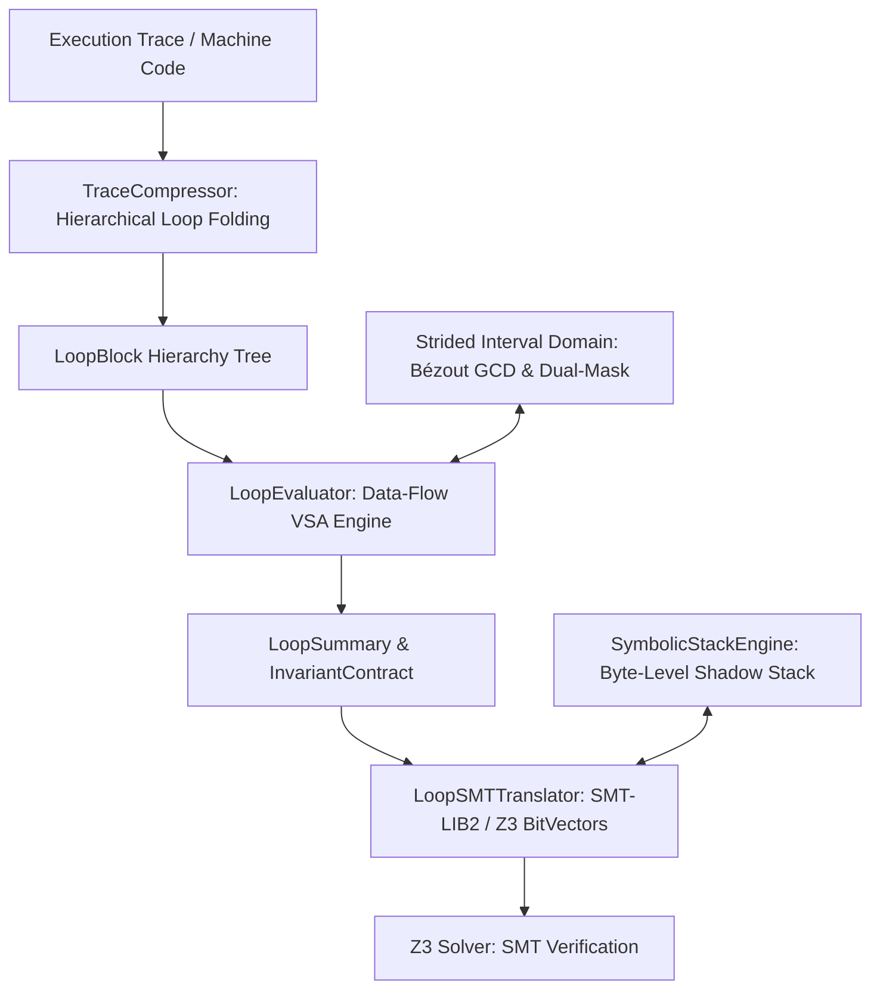

# 🌟 Strilight (v0.1.0-alpha.2)

<p align="center">
  <strong>Closed-Form SMT Loop Lifting & Strided Interval Domain for x86_64 Binary Analysis</strong>
</p>

<p align="center">
  
  
  
  
  
  
  
</p>

---

> [!NOTE]
> **🔬 Research Preview & Active Alpha Development:**
> **Strilight** is currently in active alpha development (`v0.1.0-alpha.2`). 
> The core mathematical formalisms, loop summarization algorithms, strided interval domain, byte-level shadow stack, and SMT constraint lifting are verified with 155 unit tests. High-level integrations, complex pointer aliasing, and floating-point operations are under active development.
> 
> * **API Stability:** API signatures and internal data structures may evolve between alpha releases.
> * **Feedback:** Bug reports, challenging binary samples, and discussions from the reverse engineering community are warmly welcomed!

---

## 📖 1. Overview & Motivation

Traditional Dynamic Symbolic Execution (DSE) and Dynamic Binary Instrumentation (DBI) engines (such as *angr*, *Triton*, or *KLEE*) often encounter the **Loop & Path Explosion Problem**. When analyzing loops with large or symbolic trip counts ($N = 50,000+$ iterations), classical tools unroll the loop iteration-by-iteration:
* Accumulating tens of thousands of intermediate Single Static Assignment (SSA) variables.
* Expanding memory usage and causing SMT solvers to time out.

```
Traditional Symbolic Execution (Linear Unrolling):
Trace:  [Iter 1] ──> [Iter 2] ──> ... ──> [Iter 64,000]  ===> O(N) Solver Overhead

Strilight Approach (Closed-Form Loop Lifting):
Trace ──> [TraceCompressor] ──> [LoopBlock] ──> [LoopEvaluator] ──> O(1) SMT Recurrence Formula
```

**Strilight** lifts loops into **closed-form algebraic recurrences** within a formal **Strided Interval Domain**:

$$X(N) = \mathbf{A}(N) \cdot X_0 + \mathbf{\Delta}(N)$$

Instead of stepping through every iteration, **Strilight** summarizes execution traces into hierarchical `LoopBlock` representations, extracts affine deltas, periodic patterns, and geometric scales, and compiles the entire loop into a **closed-form SMT constraint** in $O(1)$ representation time.

---

## ⚡ 2. Core Architecture & Features



1. **Trace Compression (`TraceCompressor`):** Uses sliding-window pattern detection to fold repetitive linear execution traces into hierarchical `LoopBlock` graphs without unrolling.
2. **Strided Interval Domain in $\mathbb{Z} / 2^w \mathbb{Z}$ (`StridedInterval`):** Models modular value sets as $S = s[m, M]$ with hardware circular wrap-around and 3-valued dual-mask precision (`known_mask`, `known_value`).
3. **Bézout GCD Modulo Congruence Pruning:** Proves disjointness between memory access strides in $O(1)$ without solver queries:
   $$\gcd(s_1, s_2) = g > 1 \land (m_1 \bmod g \ne m_2 \bmod g) \implies S_1 \cap S_2 = \emptyset$$
4. **Polycyclic & Periodic Recurrences:** Formulates multi-step cyclic transformations ($P > 1$) using exact quotient-remainder closed formulas:
   $$\text{Delta}(N) = \lfloor \frac{N}{P} \rfloor \cdot \sum_{i=0}^{P-1} x_i + \text{PrefixSum}(N \bmod P)$$
5. **$N-1$ Boundary Invariant Contract:** Enforces strict loop-exit conditions via AST substitution to ensure the solver does not generate spurious solutions bypassing loop boundaries.
6. **Byte-Level Shadow Stack (`SymbolicStackEngine`):** Tracks byte-level provenance and reconstructs overlapping multi-byte reads/writes on-demand via Little-Endian `z3.Concat` slicing.

---

## 🧩 3. Subsystems & Module Status

| Component | Module Path | Status | Capabilities |
| :--- | :--- | :--- | :--- |
| **Trace Compressor** | `strilight.engine.loop_compressor` | **Stable (Alpha)** | Sliding-window loop detection, hierarchical loop trees. |
| **VSA Models** | `strilight.engine.vsa.models` | **Stable (Alpha)** | Scale kernels ($A(N)$), delta kernels ($\Delta(N)$), loop summaries. |
| **VSA Evaluator** | `strilight.engine.vsa.evaluator` | **Stable (Alpha)** | Pure data-flow VSA, affine strides, periodic pattern extraction. |
| **SMT Translator** | `strilight.engine.vsa.smt_translator` | **Stable (Alpha)** | Closed-form Z3 BitVector constraint compilation, exit predicates. |
| **Stack Engine** | `strilight.engine.stack_engine` | **Stable (Alpha)** | Byte-level shadow stack, Little-Endian packing, partial overlap handling. |
| **Z3 Translator** | `strilight.engine.translator` | **Beta (Alpha)** | SSA BitVectors, subregister slicing/zero-extension, scope transitions. |
| **Strided Interval** | `strilight.pruning.interval` | **Stable (Alpha)** | Modular circular intervals, Bézout GCD, disjoint set reductions. |
| **Tracker Bridge** | `strilight.engine.tracker_bridge` | **Stable (Alpha)** | Def-use slicing, jump classification, tracer pluggability. |
| **Pointer Aliasing** | `strilight.engine.vsa` | *In Development* | Complex dynamic heap/pointer arithmetic alias resolution. |
| **Floating-Point Engine** | `strilight.engine.fpu` | *Planned* | SSE/AVX floating point SMT lifting. |

---

## 📦 4. Installation

### From Wheel Distribution:
```bash
pip install dist/strilight-0.1.0-py3-none-any.whl
```

### From Source (Editable Mode):
```bash
git clone https://github.com/asama7706r-ui/strilight.git
cd strilight
pip install -e .
```

---

## 💡 5. Usage Examples

### Option A: One-Line Loop Analysis (`sl.analyze`)
Analyze raw x86-64 machine code bytes and extract their closed-form transformations:

```python
import strilight as sl

# Loop bytecode: add eax, 8; sub ebx, 3; inc ecx; cmp ecx, 100000; jl 0x1000
loop_bytes = bytes.fromhex("83c008 83eb03 ffc1 81f9a0860100 7ced")

# Analyze loop behavior:
summary = sl.analyze(loop_bytes, iterations=100000)

print(f"Register Deltas: {summary.deltas}")
# Output: {'eax': 8, 'ebx': -3, 'ecx': 1}
```

---

### Option B: Closed-Form SMT Solving with Z3

Solve for the required input state or iteration count without loop unrolling:

```python
import strilight as sl
import z3

# 1. Analyze loop bytecode
summary = sl.analyze(loop_bytes, iterations=100000)

# 2. Initialize SMT translator
translator = sl.Z3Translator()
translator.solver.add(translator.get_register('eax') == 0)
translator.solver.add(translator.get_register('ebx') == 500000)
translator.solver.add(translator.get_register('ecx') == 0)

# 3. Lift loop summary directly into Z3
translator.translate_loop_summary(summary, max_iterations=100000)

# 4. Define Target Goal: When does EAX reach 800,000?
translator.solver.add(translator.get_register('eax') == 800000)

# 5. Solve in closed form
if translator.solver.check() == z3.sat:
    model = translator.solver.model()
    solved_n = model.eval(summary.loop_counter_var).as_long()
    print(f"[+] Solved N = {solved_n:,} iterations in closed form!")
```

---

### Option C: Byte-Level Symbolic Shadow Stack

```python
from strilight.engine.stack_engine import SymbolicStackEngine

stack = SymbolicStackEngine()

# Push 4-byte value to stack
rsp_1, written = stack.push(0x7FFFFFF0, 0x11223344, size_bytes=4, origin_instr="push_test")

# Read back
val = stack.read_val(0x7FFFFFF0 - 4, size_bytes=4)
print(hex(val.as_long()))  # 0x11223344
```

---

## 📊 6. Benchmark Suite & Ground Truth Results

Evaluated against 7 x86-64 CrackMe challenges with complex loops, subregister slicing, and modular arithmetic:

| Target Binary | Emulated Ticks | Trace Slice | Z3 Solver Status | Discovered Key | Native OS Verification | Result |
| :--- | :--- | :--- | :--- | :--- | :--- | :---: |
| `crackme_boss.exe` | 64,355 | 662 | **SAT** | `1729` | `ACCESS GRANTED` | **[PASS]** |
| `crackme_subregs.exe` | 856 | 671 | **SAT** | `1337` | `ACCESS GRANTED` | **[PASS]** |
| `crackme_license.exe` | 841 | 657 | **SAT** | `1337` | `ACCESS GRANTED` | **[PASS]** |
| `crackme_strided_circular.exe` | 12,813 | 631 | **SAT** | `1337` | `ACCESS GRANTED` | **[PASS]** |
| `crackme_telescoping.exe` | 11,812 | 630 | **SAT** | `1337` | `ACCESS GRANTED` | **[PASS]** |
| `crackme_nested_loops.exe` | 29,810 | 629 | *UNSAT (WIP)* | *N/A* | *In Development* | *[WIP]* |
| `crackme_pointers.exe` | 11,855 | 670 | *UNSAT (WIP)* | *N/A* | *In Development* | *[WIP]* |

> **Ground Truth Verification:** Discovered symbolic keys are verified against live compiled native Windows `.exe` binaries via subprocess execution.

---

## 🧪 7. Test Suite

Run unit tests across the mathematical domain, VSA evaluator, shadow stack, and SMT translator:

```bash
pytest strilight/tests/unit/
# 155 passed in <2.0s
```

Run full binary benchmark suite:

```bash
python strilight/tests/benchmarks/test_library_full.py
```

---

## 🤝 8. Contributing

Contributions and feedback are welcome! Areas of active focus:
* Challenging x86-64 loop patterns (nested loops, indirect pointers).
* Additional instruction semantics and flag side-effects.
* SMT optimization and simplification heuristics.

---

## 📄 License & Commercial Inquiries

**Strilight** is released under a **Dual-Licensing Model**:

1. **Open Source & Academic Research (GNU GPLv3+)**:  
   Free to use, modify, and distribute under the terms of the **GNU General Public License v3.0 or later**. Any derivative work or integrated binary analysis tool must also remain open source under the GNU GPLv3.
2. **Proprietary & Commercial Licensing**:  
   For enterprise integration, commercial security appliances, closed-source reverse engineering platforms, or custom licensing terms exempt from GPL copyleft obligations, please contact:
   * **Author**: Asama
   * **Email**: `asama7706r@gmail.com`
   * **Repository**: [https://github.com/asama7706r-ui/strilight](https://github.com/asama7706r-ui/strilight)

---

## 📚 Citation

If you use **Strilight** in academic research or security publications, please cite:

```bibtex
@software{strilight2026,
  title = {Strilight: Closed-Form SMT Loop Lifting & Strided Interval Domain for Binary Analysis},
  author = {Asama},
  year = {2026},
  version = {0.1.0-alpha.2},
  url = {https://github.com/asama7706r-ui/strilight}
}
```
