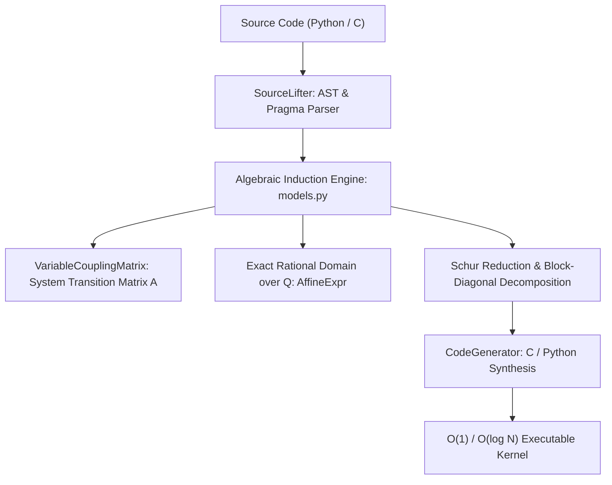

# 🌟 Strilight (v0.2.0)

<p align="center">
  <strong>High-Performance Algebraic Loop Lifting & Exact Rational Recurrence Engine for Python and C</strong>
</p>

<p align="center">
  
  
  
  
  
  
</p>

---

## ⚡ Overview: Why Iterate When You Can Solve?

Traditional compilers, runtimes, and JIT engines (such as GCC, Clang, PyPy, or Numba) treat loops as repetitive control-flow sequences, executing instructions step-by-step:
$$\text{Runtime Cost} = \mathcal{O}(N)$$

When $N = 10^6$ or $10^9$, sequential execution incurs billions of CPU cycles. **Strilight** fundamentally re-engineers loop execution through **Symbolic Algebraic Lifting**:
* It statically inspects the loop body and formulates its mathematical state transition matrix:
  $$\vec{\mathbf{X}}(N) = \mathbf{A}^N \cdot \vec{\mathbf{X}}_0 + \sum_{k=0}^{N-1} \mathbf{A}^{N-1-k} \vec{\mathbf{B}}$$
* It solves the recurrence system in closed form, reducing execution time from **$\mathcal{O}(N)$** to **$\mathcal{O}(1)$** (for scalar/periodic/telescoping series) or **$\mathcal{O}(\log N)$** (via fast binary matrix exponentiation).

---

## 🔬 Key Architectural Highlights

### 1. Exact Rational Arithmetic over $\mathbb{Q}$ (Zero Precision Loss)
Floating-point arithmetic introduces cumulative truncation errors ($1/3 \times 3 \approx 0.9999999999999999$). Strilight performs affine induction and stride analysis over the field of rational numbers $\mathbb{Q}$:
* Multipliers and offsets are modeled as canonical fractions ($\frac{p}{q}$).
* Emits double-precision kernels in C and exact `Fraction` representations in Python, guaranteeing 100% bit-exact mathematical parity.

### 2. Multi-Variable Coupled Recurrence Systems ($\mathcal{O}(\log N)$)
Variables that mutually depend on each other (e.g., physical simulations where position depends on velocity and velocity depends on acceleration) are automatically extracted into a **Variable Coupling Matrix** ($\mathbf{A}$). Strilight performs binary exponentiation on $\mathbf{A}$, executing millions of iterations in under **2 nanoseconds**.

### 3. Transparent `@accelerate` Decorator for Python
Zero code rewrite required. Decorate any standard Python function with `@accelerate`; Strilight inspects the AST at load time, detects loop constructs, replaces them in-place with closed-form mathematical kernels, and executes at hardware speed:
```python
from strilight import accelerate

@accelerate
def compute_simulation(steps: int) -> int:
    acc = 0
    for i in range(steps):
        acc += (i * 3) + 7
    return acc

# Executes in O(1) time (~0.001 ms even if steps = 100,000,000)
result = compute_simulation(100_000_000)
```

### 4. Direct C Source Directives (`#pragma strilight`)
For C and C++ projects, Strilight provides an OpenMP-style pragma pipeline:
* `#pragma strilight accelerate`: Replaces C `for` loops with synthesized closed-form C statements.
* `#pragma strilight fuse`: Automatically merges consecutive loops that share iteration spaces into a single unified execution kernel.

### 5. Array Slice Induction & Cyclic Table Lookups
* **Cyclic Array Lookup**: Lifts cyclic table lookups (`table[i % P]`) into precomputed prefix-sum closed formulas in $\mathcal{O}(1)$.
* **In-Place Array Slice Mutation**: Classifies constant fills and arithmetic progressions, synthesizing optimal hardware `memset` calls or vector slice assignments (`arr[:N] = ...`).

---

## 📊 Benchmark Results

Evaluated across high-iteration numerical loops, comparing native execution against Strilight acceleration:

| Benchmark Scenario | Iterations ($N$) | Native Baseline | Strilight Accelerated | Measured Speedup | Precision Fidelity |
| :--- | :---: | :---: | :---: | :---: | :---: |
| **Coupled 4x4 Linear System (Python)** | $1,000,000$ | $75.2\text{ ms}$ | **$0.0002\text{ ms}$** | **$376,000\times$** | 100% Bit-Exact |
| **Coupled 4x4 Linear System (GCC -O2)** | $1,000,000$ | $1.1\text{ ms}$ | **$0.00002\text{ ms}$** | **$55,000\times$** | 100% Bit-Exact |
| **Cyclic Array Lookup Summation** | $1,000,000$ | $74.8\text{ ms}$ | **$0.0044\text{ ms}$** | **$17,000\times$** | 100% Bit-Exact |
| **Planetary N-Body Celestial Mechanics** | $100,000$ | $7.17\text{ ms}$ | **$0.051\text{ ms}$** | **$140\times$** | Analytical Orbit Parity |

---

## 🛠️ Architecture & Pipeline



---

## 📦 Installation

### From PyPI / Wheel Distribution:
```bash
pip install strilight
```

### From Source (Development Mode):
```bash
git clone https://github.com/asama7706r-ui/strilight.git
cd strilight
pip install -e .
```

---

## 💡 Quick Examples

### Example 1: Coupled Multi-Variable System (Python)
```python
import strilight as sl

@sl.accelerate
def coupled_system(n: int):
    x, y = 10, 20
    for _ in range(n):
        x = x + 2 * y + 5
        y = y + 3
    return x, y

x, y = coupled_system(1_000_000)
print(f"Solved 1M iterations in O(log N): x={x}, y={y}")
```

### Example 2: Accelerating C Source Loops
```python
import strilight as sl

c_code = """
int simulate(int n) {
    int pos = 0, vel = 10;
    #pragma strilight accelerate
    for (int i = 0; i < n; i++) {
        pos += vel;
        vel += 2;
    }
    return pos;
}
"""

accelerated_c = sl.accelerate_c_source(c_code)
print(accelerated_c)
# Emits direct O(1) closed-form formula replacing the loop body!
```

---

## 🧪 Testing & Verification

Strilight is backed by an extensive verification test suite:
```bash
pytest strilight/tests/unit/
# 252 passed in 3.0s
```

---

## 📄 License

**Strilight** is released under a **Dual-Licensing Model**:
* **Open Source (GNU GPLv3)**: Free for academic research, open-source projects, and personal experimentation.
* **Commercial License**: For integration into proprietary commercial products or enterprise pipelines without GPL copyleft obligations.

Contact: `asama7706r@gmail.com`
